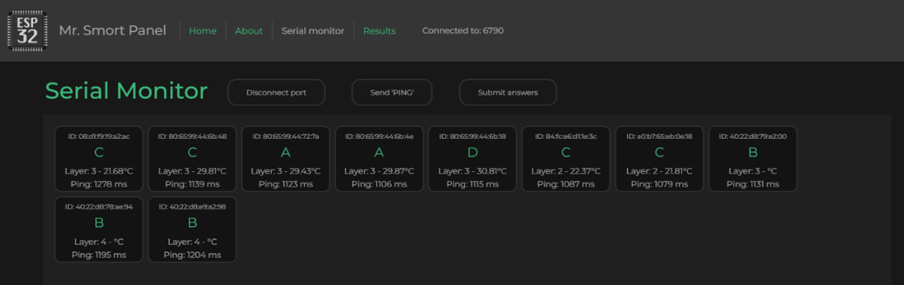
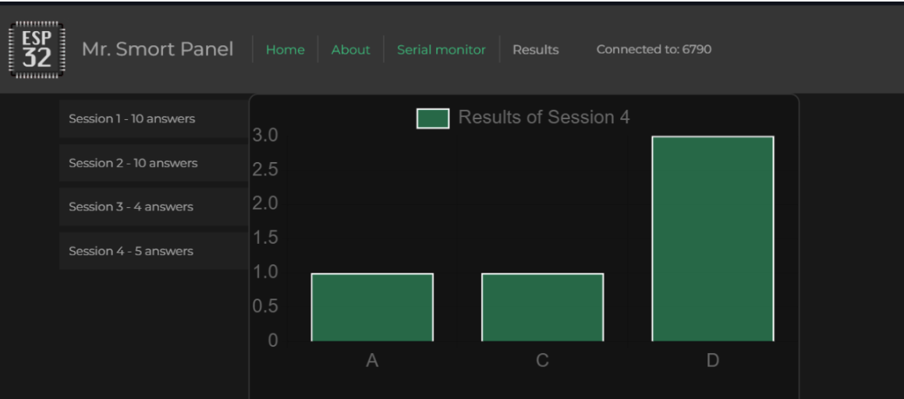

# ESP32 mesh network control panel

## Introduction

The prototype solution for the monitoring interface was built on Vue.js by using Node.js for hosting. Pinia.js was used for managing the Vue.js states and objects in a reactive and efficient way. Vue router was included for navigation. The functional part is written in typescript for type-checking of objects and allows to catch errors more effectively. Web Serial API was used for data exchange with ESP32 through the USB port.

Although the Web Serial API isn’t compatible with firefox, Safari and mobile devices right now, it was still chosen for the reason of being fully supported on chromium based browsers.

## The main view populated with information received from the ESP32 network

## The Results view showcasing submitted answers by the user

## Initialization

Tested on Node.js v20.12.2

~~~
smort-man> npm i

smort-man> npm run dev

> smort-man@0.0.1 dev
> vite

  VITE v5.2.8  ready in 686 ms

  ➜  Local:   http://localhost:5173/
  ➜  Network: use --host to expose
  ➜  Vue DevTools: Open http://localhost:5173/__devtools__/ as a separate window
  ➜  Vue DevTools: Press Alt(⌥)+Shift(⇧)+D in App to toggle the Vue DevTools

  ➜  press h + enter to show help

~~~
